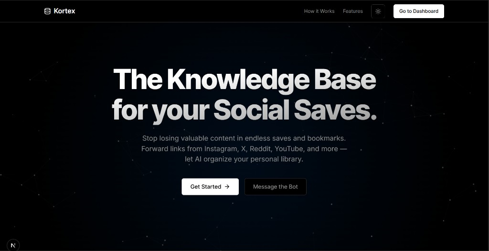
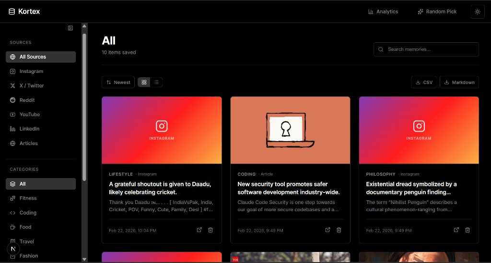
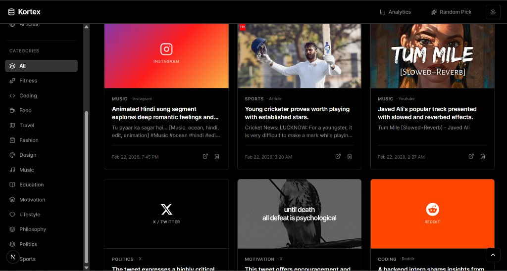

# Kortex

> Built for **[Hack the Thread](https://unstop.com/hackathons/hack-the-thread-nitk-surathkal-1642360)** — a hackathon by 180 Degrees Consulting, NITK Surathkal.

**The Knowledge Base for your Social Saves.**

Stop losing valuable content buried in endless saves and bookmarks. Kortex lets you forward any social media link to a WhatsApp bot, which uses AI to auto-categorize, summarize, and store it in a searchable personal dashboard.

---

## Demo

> **Screen Recording:** [Watch the demo video](https://drive.google.com/file/d/1kBrfudUNL-nc_FcnMCp_w3AvjkQ6RUN2/view?usp=sharing)

---

## Screenshots

### Landing Page


### Dashboard




---

## The Problem

We all do it — you're scrolling through Instagram, you see a great workout routine, a design tip, or a coding hack. You hit "Save," but you never look at it again. It gets buried in a hidden folder, lost forever.

Kortex fixes this. One WhatsApp message. AI does the rest.

## How It Works

```
1. Send a Link    →  Forward any social media URL to the Kortex WhatsApp bot
2. AI Processes   →  Scrapes content, generates a summary, auto-assigns a category
3. Dashboard      →  Browse, search, and filter your saved content anytime
```

### Supported Platforms

| Platform | Scraping Method | Embed Support |
|----------|----------------|---------------|
| Instagram | Supadata API → noembed → HTML meta tags | iframe (thumbnail + link-out) |
| X / Twitter | Supadata API → noembed → HTML meta tags | Native tweet embed |
| Reddit | Reddit JSON API → HTML fallback | redditmedia embed |
| YouTube | noembed → HTML meta tags | YouTube player embed |
| LinkedIn | HTML meta tags (og:tags) | Rich article preview |
| Articles / Blogs | HTML meta tags (og:tags) | Rich article preview |

## Features

- **WhatsApp Bot Interface** — No app to download. Just text a link to the bot on WhatsApp.
- **Multi-Platform Scraping** — Extracts captions, thumbnails, authors, and tags from Instagram, X, Reddit, YouTube, LinkedIn, and articles using a multi-strategy fallback system.
- **AI Categorization & Summarization** — Google Gemini auto-tags content into categories (Fitness, Coding, Food, Travel, etc.) and writes concise headline-style summaries. If no predefined category fits, the AI invents a new one.
- **Duplicate Detection** — If you send the same link twice, the bot tells you when you already saved it instead of creating duplicates.
- **Searchable Dashboard** — Filter by platform, category, or free-text search. Cards show thumbnails, summaries, and platform badges.
- **Embedded Previews** — Click a card to see the actual YouTube video, tweet, or Reddit post embedded inline. Articles show a rich link preview with thumbnail and domain.
- **Sort & View Modes** — Toggle between Newest/Oldest sort order and Grid/List view.
- **Analytics Dashboard** — A popup showing total saves, weekly stats, top categories, and platform breakdown with visual bar charts.
- **Export** — Download your saved links as CSV or Markdown.
- **Random Inspiration** — A "Random Pick" button surfaces a random saved link for rediscovery.
- **Dark / Light Mode** — System-aware theme toggle with smooth transitions.
- **Collapsible Sidebar** — Toggle the sidebar to give the card grid more space.
- **Animated Particle Background** — Interactive floating dots on the landing page that react to mouse movement.
- **Fully Responsive** — Mobile-first design with stacking cards, horizontal sidebar, and thumb-friendly buttons.
- **Async Processing** — Bot replies instantly with "Processing...", then sends a follow-up WhatsApp message with the AI summary once done (avoids Twilio's 15s timeout).

## Tech Stack

| Layer | Technology |
|-------|-----------|
| Framework | [Next.js 16](https://nextjs.org/) (App Router) |
| Frontend | React 19, Framer Motion, Lucide Icons |
| Styling | Pure CSS with CSS custom properties (Vercel-inspired design system) |
| Theme | [next-themes](https://github.com/pacocoursey/next-themes) |
| Database | [Supabase](https://supabase.com/) (PostgreSQL) |
| Bot Interface | [Twilio WhatsApp Sandbox](https://www.twilio.com/docs/whatsapp/sandbox) |
| AI / LLM | [Google Gemini](https://ai.google.dev/) (gemini-2.5-flash-lite, gemini-3-flash) |
| Scraping | [Supadata.ai](https://supadata.ai/) Metadata API, noembed, HTML meta tag extraction, Reddit JSON API |
| Tunnel | [ngrok](https://ngrok.com/) (for local development webhook exposure) |

## Architecture

```
                          ┌──────────────────────────────────────┐
                          │         User's Phone (WhatsApp)      │
                          └──────────────┬───────────────────────┘
                                         │ sends link
                                         ▼
                          ┌──────────────────────────────────────┐
                          │         Twilio WhatsApp Sandbox       │
                          │     (receives message, triggers       │
                          │      webhook POST to our server)      │
                          └──────────────┬───────────────────────┘
                                         │ POST /api/webhook
                                         ▼
                          ┌──────────────────────────────────────┐
                          │              ngrok Tunnel              │
                          │   (exposes localhost:3000 to the      │
                          │    internet for Twilio to reach)      │
                          └──────────────┬───────────────────────┘
                                         │ forwards to localhost
                                         ▼
┌────────────────────────────────────────────────────────────────────────────┐
│                     Next.js App (localhost:3000)                           │
│                                                                            │
│  /api/webhook                                                              │
│  ┌──────────────────────────────────────────────────────────────────────┐  │
│  │  1. Extract URL from message                                         │  │
│  │  2. Check for duplicates ──────────▶ Supabase (lookup by URL)        │  │
│  │  3. Scrape content ──────────────┐                                   │  │
│  │  4. AI categorize + summarize    │                                   │  │
│  │  5. Save to database             │                                   │  │
│  │  6. Send follow-up via Twilio    │                                   │  │
│  └──────────────────────────────────┼───────────────────────────────────┘  │
│                                     │                                      │
│         ┌───────────────────────────┼──────────────────┐                   │
│         ▼                           ▼                  ▼                   │
│  ┌─────────────┐   ┌──────────────────────┐   ┌──────────────┐            │
│  │ Scraper     │   │     Gemini AI        │   │   Supabase   │            │
│  │ Service     │   │  (categorize +       │   │  (PostgreSQL │            │
│  │             │   │   summarize)         │   │   database)  │            │
│  └──────┬──────┘   └──────────────────────┘   └──────────────┘            │
│         │                                                                  │
│    ┌────┼─────────┬───────────┬────────────┐                               │
│    ▼    ▼         ▼           ▼            ▼                               │
│ Supadata  noembed.com   Reddit JSON   HTML/og:tags                         │
│   API                      API                                             │
└────────────────────────────────────────────────────────────────────────────┘
                                         │
                                         │ Twilio REST API
                                         ▼
                          ┌──────────────────────────────────────┐
                          │     User receives follow-up message   │
                          │   with category, summary, and emoji   │
                          └──────────────────────────────────────┘
```

## Project Structure

```
src/
├── app/
│   ├── api/
│   │   ├── links/route.js        # GET/DELETE API for saved links
│   │   └── webhook/route.js      # Twilio webhook — receives WhatsApp messages
│   ├── dashboard/page.js         # Dashboard with filters, search, cards, embeds
│   ├── globals.css               # Global styles, theme variables, responsive design
│   ├── layout.js                 # Root layout with ThemeProvider
│   └── page.js                   # Landing page with particle background
├── components/
│   ├── ParticlesBg.jsx           # Animated interactive particle canvas
│   ├── PostEmbed.jsx             # Embedded previews (YouTube, X, Reddit, Instagram, articles)
│   └── ThemeToggle.jsx           # Dark/light mode toggle
├── lib/
│   ├── supabaseClient.js         # Supabase browser client
│   └── supabaseServer.js         # Supabase server client
└── services/
    ├── aiService.js              # Gemini AI categorization & summarization
    ├── linkService.js            # Supabase CRUD + duplicate detection
    └── scraperService.js         # Multi-strategy scraper for all platforms
```

## Getting Started

### Prerequisites

- Node.js 18+
- A [Supabase](https://supabase.com/) project with a `links` table
- A [Twilio](https://www.twilio.com/) account with WhatsApp Sandbox enabled
- A [Google AI Studio](https://aistudio.google.com/) API key (Gemini)
- A [Supadata.ai](https://supadata.ai/) API key
- [ngrok](https://ngrok.com/) for local webhook tunneling

### Supabase Table Schema

Create a `links` table in your Supabase project:

```sql
CREATE TABLE links (
  id UUID DEFAULT gen_random_uuid() PRIMARY KEY,
  url TEXT NOT NULL,
  caption TEXT,
  summary TEXT,
  category TEXT,
  thumbnail TEXT,
  platform TEXT,
  author TEXT,
  tags TEXT[],
  created_at TIMESTAMP WITH TIME ZONE DEFAULT NOW()
);
```

### Environment Variables

Create a `.env.local` file in the project root:

```env
# Supabase
NEXT_PUBLIC_SUPABASE_URL=your_supabase_url
NEXT_PUBLIC_SUPABASE_ANON_KEY=your_supabase_anon_key

# Twilio
TWILIO_ACCOUNT_SID=your_twilio_sid
TWILIO_AUTH_TOKEN=your_twilio_auth_token
TWILIO_WHATSAPP_NUMBER=+14155238886

# Gemini AI
GEMINI_API_KEY=your_gemini_api_key

# Supadata
SUPADATA_API_KEY=your_supadata_api_key
```

### Installation

```bash
git clone https://github.com/ctheface/kortex.git
cd kortex
npm install
npm run dev
```

### Setting Up the WhatsApp Bot

1. Start ngrok to expose your local server:
   ```bash
   ngrok http 3000
   ```

2. Copy the ngrok HTTPS URL (e.g., `https://abc123.ngrok-free.app`)

3. Go to [Twilio Console → WhatsApp Sandbox](https://console.twilio.com/us1/develop/sms/try-it-out/whatsapp-learn)

4. Set the webhook URL to:
   ```
   https://your-ngrok-url.ngrok-free.app/api/webhook
   ```
   Method: **POST**

5. Send `join <sandbox-keyword>` to the Twilio WhatsApp number to activate your sandbox

6. Start sending links!

## Usage

1. **Send a link** — Forward any Instagram reel, YouTube video, tweet, Reddit post, or article URL to the WhatsApp bot
2. **Get confirmation** — The bot instantly replies "Processing..." and then sends a follow-up with the AI-generated category and summary
3. **Duplicate check** — If you send the same link again, the bot tells you it's already saved with the date and category
4. **Browse the dashboard** — Visit `localhost:3000/dashboard` to see all your saved content
5. **Filter & search** — Use the sidebar to filter by platform or category, or use the search bar
6. **Sort & switch views** — Toggle between Newest/Oldest and Grid/List view
7. **View embeds** — Click any card to open the spotlight modal with an embedded preview
8. **Analytics** — Click "Analytics" in the nav for stats on your saved content
9. **Export** — Download your library as CSV or Markdown
10. **Random pick** — Click "Random Pick" in the nav to rediscover a random saved link

---

Built for **Hack the Thread** by 180 Degrees Consulting, NITK Surathkal — February 2026.
